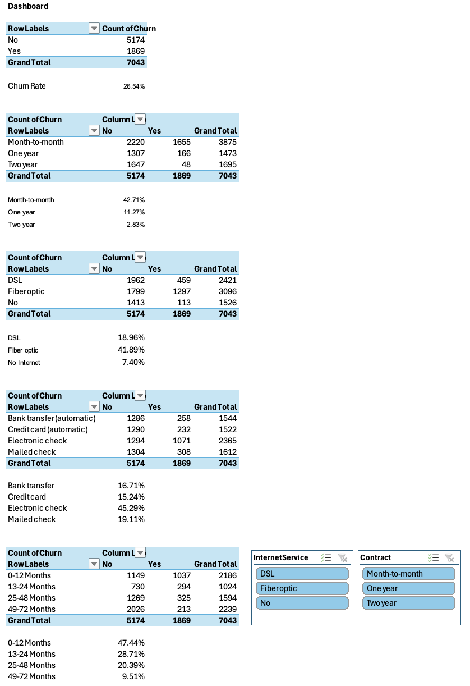
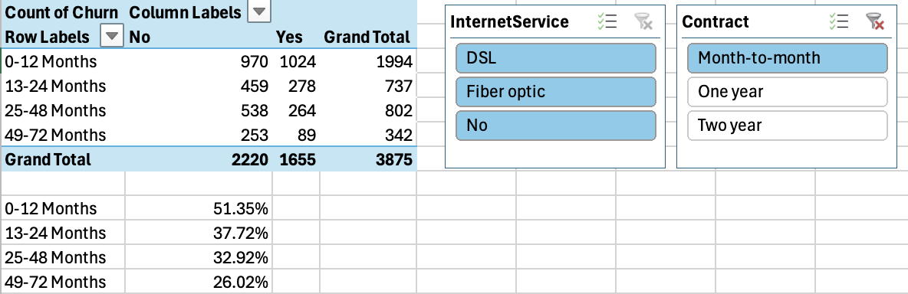
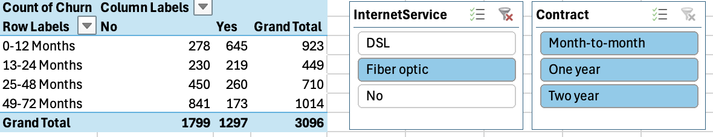
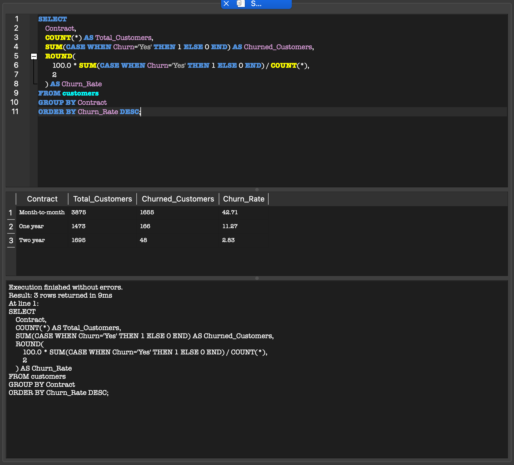
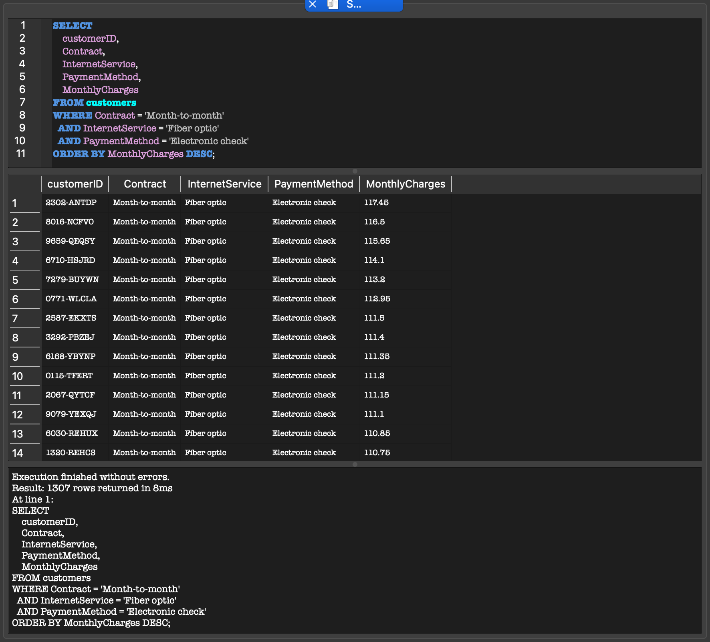

# Customer Churn Analysis

Customer churn analysis project built using SQL, Excel and Power BI to identify customer retention patterns, churn drivers and high-risk customer segments. The project combines data cleaning, SQL analysis and interactive dashboards to generate business insights that support customer retention strategies.

---

## Project Overview

This project analyses the IBM Telco Customer Churn dataset to answer key business questions, including:

- What is the overall customer churn rate?
- Which contract types have the highest churn?
- Which internet services experience the most churn?
- Which payment methods are associated with higher customer loss?
- How does customer tenure influence churn?

The analysis was completed using SQL, Excel and Power BI.

---

## Tools Used

- SQL
- Excel
- Power BI

---

## Dataset

IBM Telco Customer Churn Dataset

- Total Customers: **7,043**
- Churned Customers: **1,869**
- Overall Churn Rate: **26.54%**

---

## Business Questions Answered

- Overall customer churn rate
- Churn by contract type
- Churn by internet service
- Churn by payment method
- Churn by customer tenure
- Identification of high-risk customer segments

---

## Key Insights

- Overall customer churn rate is **26.54%**.
- Customers with **Month-to-month contracts** have the highest churn rate (**42.71%**).
- **Fiber optic** customers experience the highest churn rate (**41.89%**).
- Customers paying through **Electronic check** show the highest churn rate (**45.29%**).
- Most customer churn occurs within the **first 12 months** of service.

---

## Repository Structure

```text
customer-churn-analysis/
│
├── data/
│   ├── raw/
│   │   └── WA_Fn-UseC_-Telco-Customer-Churn.csv
│   └── cleaned/
│       └── Telco-Customer-Churn-cleaned.csv
│
├── excel/
│   └── customer_churn_dashboard.xlsx
│
├── powerbi/
│
├── sql/
│   └── customer_churn_analysis.sql
│
├── screenshots/
│   ├── excel_dashboard.png
│   ├── excel_dashboard_contract_filter.png
│   ├── excel_dashboard_internet_filter.png
│   ├── sql_contract_churn_analysis.png
│   └── sql_high_risk_customers.png
│
├── LICENSE
└── README.md
```

---

## Excel Dashboard

The Excel dashboard was created using Pivot Tables, Pivot Charts and Slicers to analyse customer churn across multiple dimensions.

Dashboard features include:

- Overall churn summary
- Churn by contract type
- Churn by internet service
- Churn by payment method
- Churn by tenure group
- Interactive Contract and Internet Service filters

### Dashboard



### Contract Filter



### Internet Service Filter



---

## Power BI Dashboard

An interactive Power BI dashboard was also developed using the cleaned dataset.

The dashboard includes:

- KPI cards
- Customer churn by contract
- Customer churn by internet service
- Customer churn by payment method
- Customer churn by tenure
- Interactive slicers for Contract and Internet Service

The Power BI dashboard file is available in the **powerbi** folder.

---

## SQL Analysis

SQL was used to analyse customer behaviour and identify high-risk customer segments.

Example analyses include:

- Contract-wise churn analysis
- High-risk customer identification

### Contract Churn Analysis



### High-Risk Customers



---

## Business Recommendations

- Encourage customers to move from Month-to-month contracts to longer-term plans.
- Improve customer experience for Fiber optic users.
- Investigate the high churn associated with Electronic check payments.
- Focus retention efforts on customers during their first year.
- Identify high-risk customers early and implement proactive retention strategies.

---

## Author

**Sharmistha Barua**

GitHub: https
```
