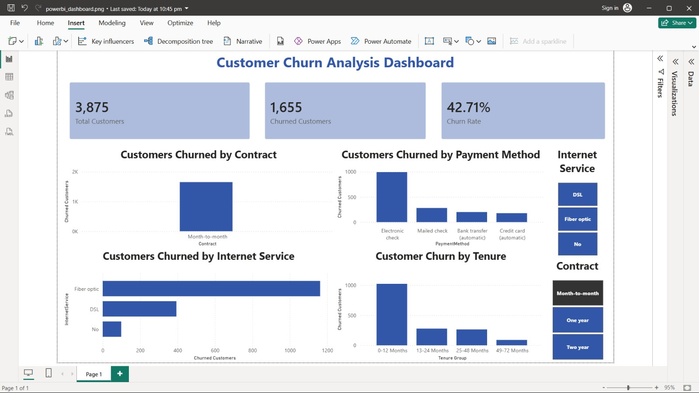
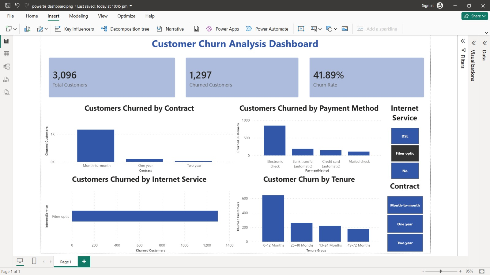

# Customer Churn Analysis

An end-to-end customer churn analytics project built using **SQL, Excel and Power BI** to analyse customer retention patterns, identify churn drivers and generate business recommendations using the IBM Telco Customer Churn dataset.

---

## Project Overview

Customer churn is one of the most important business metrics for subscription-based companies. This project analyses customer behaviour to identify the factors associated with customer churn and provides actionable recommendations to improve customer retention.

The analysis was completed using SQL for data exploration, Excel for dashboard creation and Power BI for interactive business reporting.

---

## Tools & Technologies

- Microsoft Excel
- SQL (SQLite)
- Microsoft Power BI
- Git & GitHub

---

## Dataset

**IBM Telco Customer Churn Dataset**

The dataset contains **7,043 customer records** with information including:

- Customer demographics
- Contract type
- Internet service
- Payment method
- Monthly charges
- Customer tenure
- Churn status

---

## Business Questions

This project answers the following business questions:

- What is the overall customer churn rate?
- Which contract types have the highest churn?
- Which internet services experience the highest churn?
- Which payment methods are associated with the highest churn?
- Does customer tenure influence churn?
- Which customers are at the highest risk of leaving?

---

## Repository Structure

```text
customer-churn-analysis/
│
├── data/
│   ├── cleaned/
│   │   └── Telco-Customer-Churn-Cleaned.csv
│   │
│   └── raw/
│       └── WA_Fn-UseC_-Telco-Customer-Churn.csv
│
├── excel/
│   └── customer_churn_dashboard.xlsx
│
├── powerbi/
│   └── customer_churn_dashboard.pbix
│
├── screenshots/
│   ├── excel_dashboard.png
│   ├── excel_dashboard_contract_filter.png
│   ├── excel_dashboard_internet_filter.png
│   ├── powerbi_dashboard_contract_filter.jpeg
│   ├── powerbi_dashboard_fiber_optic_filter.jpeg
│   ├── sql_contract_churn_analysis.png
│   └── sql_high_risk_customers.png
│
├── sql/
│   └── customer_churn_analysis.sql
│
├── business_insights.txt
├── project_summary.txt
├── LICENSE
└── README.md
```

---

## Project Workflow

1. Imported and cleaned the IBM Telco Customer Churn dataset.
2. Analysed customer behaviour using SQL.
3. Performed exploratory analysis in Excel.
4. Built an interactive Excel dashboard using Pivot Tables, Pivot Charts and Slicers.
5. Developed an interactive Power BI dashboard.
6. Generated business insights and recommendations.

---

## SQL Analysis

The SQL analysis includes:

- Overall churn analysis
- Contract-wise churn analysis
- Internet service analysis
- Payment method analysis
- High-risk customer identification
- Business KPI calculations

### Contract Churn Analysis

This query calculates the churn rate for each contract type and highlights that customers on month-to-month contracts are significantly more likely to churn.


---

### High-Risk Customer Identification

This query identifies customers with month-to-month contracts, Fiber optic internet and Electronic check payments, helping businesses identify high-risk customer segments.


---

## Excel Dashboard

The Excel dashboard provides an interactive overview of customer churn.

### Dashboard Features

- Total Customers
- Churned Customers
- Overall Churn Rate
- Churn by Contract Type
- Churn by Internet Service
- Churn by Payment Method
- Churn by Customer Tenure
- Interactive Contract Filter
- Interactive Internet Service Filter

### Dashboard Overview


---

### Contract Filter


---

### Internet Service Filter


---

## Power BI Dashboard

An interactive Power BI dashboard was developed to visualise customer churn patterns.

### Dashboard Features

- KPI Cards
- Churn by Contract
- Churn by Internet Service
- Churn by Payment Method
- Churn by Customer Tenure
- Interactive Slicers

### Contract Filter



---

### Fiber Optic Filter



---

## Key Business Insights

- Overall customer churn rate: **26.54%**
- Month-to-month contracts recorded the highest churn rate (**42.71%**).
- Fiber optic customers experienced the highest churn rate (**41.89%**).
- Customers using Electronic check had the highest churn rate (**45.29%**).
- Customers within their first year recorded the highest churn rate (**47.44%**).
- Customer churn decreased significantly as tenure increased.

---

## Business Recommendations

- Encourage customers to move from month-to-month contracts to longer-term contracts.
- Improve customer retention during the first year of service.
- Investigate customer satisfaction among Fiber optic users.
- Promote automatic payment methods to reduce churn.
- Develop targeted retention campaigns for high-risk customer segments.

---

## Additional Documentation

- **business_insights.txt** – Detailed business insights and recommendations.
- **project_summary.txt** – Project objective, tools used and key findings.

---

## Skills Demonstrated

- SQL
- Data Cleaning
- Exploratory Data Analysis
- Customer Segmentation
- Dashboard Development
- KPI Reporting
- Business Intelligence
- Microsoft Excel
- Microsoft Power BI
- Business Storytelling

---

## Author

**Sharmistha Barua**

MSc Management | Data Analytics | Business Intelligence

**GitHub:** https://github.com/iam-sharmistha

**LinkedIn:** https://www.linkedin.com/in/iamsharmistha
